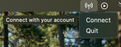

# Turbo Client Node

The Turbo client node is a lightweight app that earns you passive crypto rewards for sharing your unused Internet bandwidth in the background.

## Run a Node

The Turbo client node is a lightweight process that runs in the background and that lets you earn passive crypto rewards for sharing your unused Internet bandwidth.

#### Compatibility

| Platform | Supported |
|----------|-----------|
| Windows  | ✅         |
| macOS    | ✅         |
| Linux    | ✅         |
| Mobile   | ❌         |

#### Installation

- Download the [latest release](https://github.com/L1shed/Turbo/releases) for your platform on GitHub, or go to [our website](https://turbo-node.vercel.app/download) for easy download.
- Open the downloaded executable — a new icon will appear in your system tray.
- Click the icon to open the popup, then select **"Pair to Account"**.

> On a server with no desktop, use the one-line install command from the
> **Download** page of your dashboard instead — it installs, starts and pairs
> the node in one step, with no browser needed on that machine. See
> [Headless / Docker](#headless--docker).


- A page will open, if authentication is successful, you will be redirected to the dashboard and your new node will appear in the nodes list.

  You can add an unlimited amount of nodes as long as they are on different networks/IPs. For example, you can run a node on your PC, laptop, TV, Raspberry Pi, android phone, etc.

🎉 Congratulations! Your node is now earning passively, check out your dashboard regularly

#### Monetization

Base reward is `$0.40` per GB shared but bonuses apply such as if:
* Your node has reached a decent daily uptime over several days.
* Your node has a stable _long-term_ connection.

`$0.40` may seem low but the network is small, therefore the handled bandwidth per node is higher.

For example, an average node shares 0.05 GB/hour of bandwidth.
If the user owns 5 nodes on distinct devices, the total shared bandwidth is 0.25 GB/hour, which is 6 GB/day and 180 GB/month.
At the current price rate the user is expected to earn **$72/month** + bonuses if running the nodes 24/7.

## Development

Run the client from a terminal and the log goes to the terminal only:

```bash
go run .
```

Launched without a terminal (the packaged app, a service manager) it also
appends to `turbo.log` in the user config directory, since stderr has nowhere
to go. Override with `TURBO_LOG_FILE=1` to force the file on, or `0` off.

TLS certificate verification is skipped for loopback addresses, so a local
server with a self-signed certificate works with no extra setup. For a
self-signed server on another address, set `TURBO_INSECURE_TLS=1`. Every other
host is verified normally.

### Headless / Docker

`cmd/turbod` is the same node with no tray icon, popup or self-update — just
the QUIC connection, plus a one-shot `--install` mode described below. It
builds with `CGO_ENABLED=0` and has no GTK/WebKit dependency, so it's the one
to use in a container:

```bash
go build -o turbod ./cmd/turbod
```

The published image is built from the repo root `Dockerfile`:

```bash
docker build -t turbo-node .
docker run -d --name turbo-node -v turbo-data:/data turbo-node
```

The named volume persists the host cache and paired state across restarts.
There's no popup to click "Pair to Account" from — instead, watch the logs
for the pairing URL and open it in a browser:

```bash
docker logs -f turbo-node
```

#### Installing directly on a server

Outside a container, the **Download** page of the dashboard generates a
command that does the whole thing in one step — download, install as a
service, and pair:

```bash
curl -fsSL https://turbo.network/install.sh | bash -s -- --pair-token=<token>
```

The token is minted against your account, is good for one node, and expires
in 20 minutes. The script installs `turbod` to `~/.local/bin` and runs
`turbod --install`, which registers it to start on boot — a systemd *user*
service on Linux (`systemctl --user status turbod`) or a LaunchAgent on macOS
— and leaves the token for the daemon to present on its first connection. No
`sudo`, and no browser needed on that machine.

On Linux this relies on `loginctl enable-linger`, which the installer enables
so the node starts at boot without anyone logging in. If linger can't be
enabled the install still succeeds and the node still runs, but it won't come
back on its own after a reboot.

To pair a node you've already installed by hand, pass the token yourself:

```bash
TURBO_PAIR_TOKEN=<token> turbod --install
```
